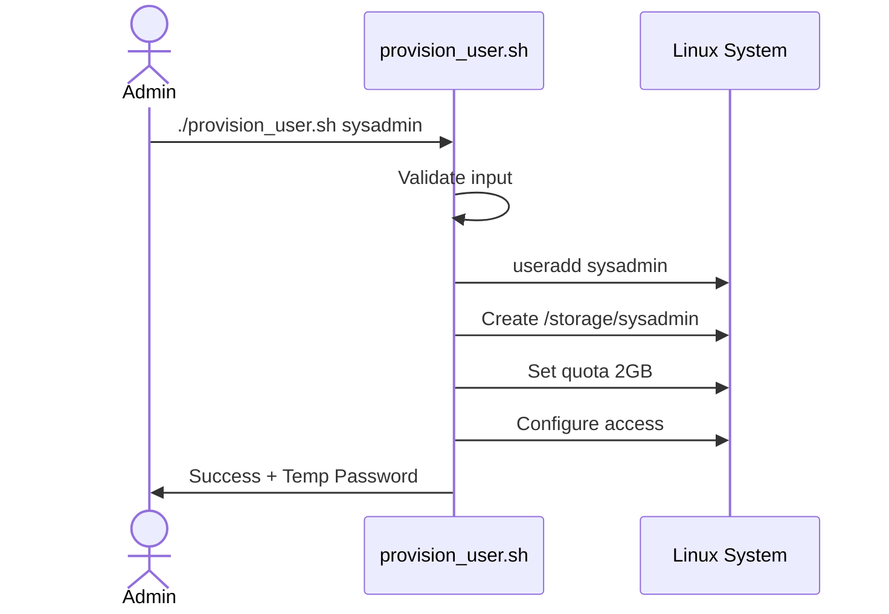
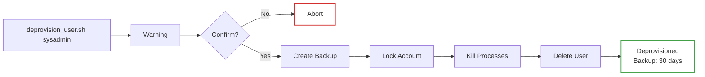
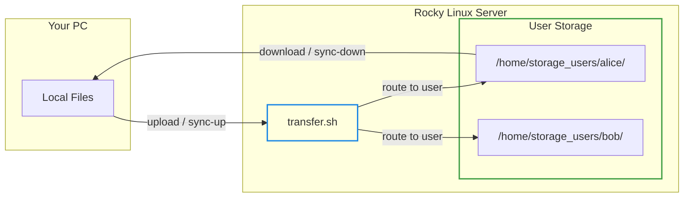
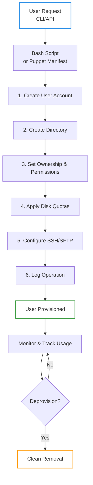
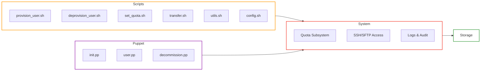
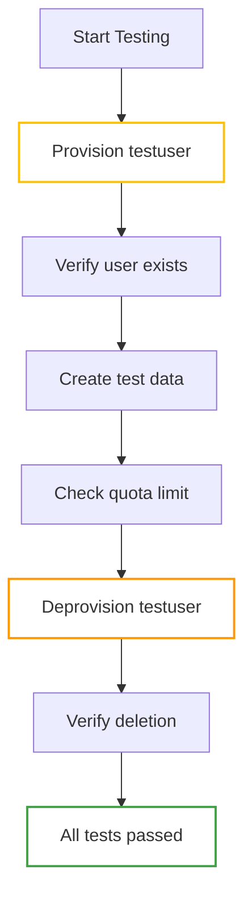

# Automated Storage Provisioning Tool

[](https://opensource.org/licenses/MIT)
[](https://rockylinux.org/)
[](https://puppet.com/)
[](https://www.gnu.org/software/bash/)
[](https://github.com/yourusername/automated-storage-provisioning)
[](https://github.com/yourusername/automated-storage-provisioning)

Automate user account creation, directory provisioning, disk quota management, and cleanup on Rocky Linux using Puppet and Bash scripts. Perfect for multi-user environments requiring consistent storage management.

> **Work in Progress**

## Development Workflow

For local development with a VM, use the sync scripts to easily transfer files:

```bash
# Make scripts executable
chmod +x scripts/*.sh

# (Optional) Set up personal sync config
./sync_vm.sh --setup-config

# Edit ~/.sync_vm.conf with your VM details, then sync!
./sync_vm.sh push
```

## Quick Start

**Prerequisites:** Rocky Linux VM, 2+ CPU cores, 4GB RAM, Puppet, and sudo access

```bash
# Clone the repository
git clone https://github.com/aaronwittchen/Automated-Storage-Provisioning-Tool.git
cd automated-storage-provisioning
# Install dependencies
sudo dnf install -y puppet quota xfsprogs openssh-server git
# Run initial setup
sudo ./scripts/provision_user.sh newuser
# Verify
repquota -a
```

That's it! A new user is created with a managed storage directory and 2GB quota.

## Table of Contents

- [Features](#features)
- [Prerequisites](#prerequisites)
- [Installation](#installation)
- [Usage](#usage)
- [File Transfer](#file-transfer)
- [Architecture](#architecture)
- [Configuration](#configuration)
- [Troubleshooting](#troubleshooting)
- [Testing](#testing)
- [Monitoring & Maintenance](#monitoring--maintenance)
- [Optional Enhancements](#optional-enhancements)
- [Contributing](#contributing)
- [License](#license)
- [Support](#support)
- [Authors](#authors)
- [Changelog](#changelog)

## Features

- **Automated User Provisioning** — Create users with one command
- **Disk Quotas** — Enforce soft/hard limits automatically (XFS, EXT4, Btrfs, ZFS)
- **File Transfer** — Upload, download, and sync files to user storage
- **Access Control** — SSH/SFTP with chroot isolation (optional)
- **Batch Operations** — Provision multiple users from a file
- **Safe Deprovisioning** — Clean removal with backup options
- **Puppet Integration** — Infrastructure-as-Code configuration management
- **Centralized Config** — All settings in one place (`config.sh`)
- **Monitoring** — Track usage and quota violations

## Prerequisites

- **OS:** Rocky Linux 8.x or 9.x (RHEL-compatible)
- **Hypervisor:** VirtualBox, VMware, KVM, or physical server
- **Resources:** 2+ CPU cores, 4GB+ RAM, 20GB+ disk
- **Network:** SSH access enabled
- **Packages:** Puppet 7+, quota-tools, xfsprogs

### Why Rocky Linux?
Rocky Linux is enterprise-grade, RHEL-compatible, and provides stable support for Puppet, Ansible, and system utilities — ideal for long-term infrastructure automation.

## Installation

### 1. VM Setup
Create a Rocky Linux VM with:

- 2 CPU cores
- 4GB RAM
- 20–40GB disk (XFS filesystem)
- NAT or bridged networking

### 2. System Configuration

```bash
# Enable SSH
sudo systemctl enable --now sshd
# Update system
sudo dnf update -y
# Install required packages
sudo dnf install -y puppet quota xfsprogs openssh-server vim git
# Enable quota services
sudo systemctl enable --now quotaon
```

### 3. Configure Quotas on Filesystem
Edit `/etc/fstab`:

```text
/dev/sda1 / xfs defaults,uquota 0 0
```

Remount and initialize:

```bash
sudo mount -o remount /
sudo quotacheck -cum /
sudo quotaon /
```

### 4. Clone This Repository

```bash
git clone <your-repo-url>
cd automated-storage-provisioning
# Make scripts executable
chmod +x scripts/*.sh
```

### 5. (Optional) Deploy Puppet Manifests

```bash
sudo cp manifests/*.pp /etc/puppetlabs/code/environments/production/manifests/
sudo puppet apply /etc/puppetlabs/code/environments/production/manifests/init.pp
```

## Usage

### Provision a Single User

```bash
sudo ./scripts/provision_user.sh sysadmin
```

Creates:
- System user `sysadmin`
- Directory `/storage/sysadmin` with 700 permissions
- 2GB soft limit / 2.5GB hard limit quota
- Membership in `storageusers` group



### Provision Multiple Users
Create a file `users.txt`:

```text
sysadmin
bob
charlie
```

Then run:

```bash
while read user; do
  sudo ./scripts/provision_user.sh "$user"
done < users.txt
```

### Set Custom Quota

```bash
# Set quota with automatic hard limit (soft * 1.25)
sudo ./scripts/set_quota.sh set sysadmin 5G

# Set quota with custom soft and hard limits
sudo ./scripts/set_quota.sh set sysadmin 5G --hard 6G

# View user's quota
sudo ./scripts/set_quota.sh show sysadmin

# View all quotas
sudo ./scripts/set_quota.sh report

# Remove quota restrictions
sudo ./scripts/set_quota.sh remove sysadmin

# Check if quota is supported on filesystem
sudo ./scripts/set_quota.sh check
```

### Check User Storage Usage

```bash
sudo quota -u sysadmin
sudo repquota -a # Show all users
```

### Deprovision a User

```bash
sudo ./scripts/deprovision_user.sh sysadmin
```

Removes:
- User account
- Home directory
- Quota entries
- Group memberships (optional)



### Deploy via Puppet

```bash
sudo puppet apply manifests/init.pp
```

For per-user provisioning:

```bash
sudo puppet apply -e "include storage_provisioning::users"
```

## File Transfer

Transfer files to and from user storage directories using the `transfer.sh` utility.

### Upload Files

```bash
# Upload a file to user's data directory (default)
sudo ./scripts/transfer.sh upload alice report.zip

# Upload to a specific subdirectory
sudo ./scripts/transfer.sh upload alice backup.tar.gz backups/

# Remote upload (from your PC to server)
./scripts/transfer.sh upload alice myfile.zip -r admin@192.168.1.100
```

### Download Files

```bash
# Download from user's storage
sudo ./scripts/transfer.sh download alice data/report.zip ./

# Download to specific local directory
sudo ./scripts/transfer.sh download alice data/project.zip ~/downloads/

# Remote download (from server to your PC)
./scripts/transfer.sh download alice data/report.zip -r admin@192.168.1.100
```

### Sync Directories

```bash
# Sync local folder TO user's storage (upload)
sudo ./scripts/transfer.sh sync-up alice ./project-files/ data/project/

# Sync FROM user's storage to local (download)
sudo ./scripts/transfer.sh sync-down alice data/project/ ./local-copy/

# Remote sync with compression
./scripts/transfer.sh sync-up alice ./docs/ -r admin@server --compress
```

### List & Usage

```bash
# List files in user's storage
sudo ./scripts/transfer.sh list alice

# List specific subdirectory
sudo ./scripts/transfer.sh list alice data/

# Show disk usage breakdown
sudo ./scripts/transfer.sh usage alice
```

### File Transfer Workflow



### Transfer Options

| Option | Description |
|--------|-------------|
| `-r, --remote HOST` | Remote server (user@host) for remote transfers |
| `-p, --port PORT` | SSH port (default: 22) |
| `-k, --key KEYFILE` | SSH private key file |
| `-n, --dry-run` | Show what would be transferred |
| `-v, --verbose` | Verbose output |
| `--compress` | Enable compression |
| `--delete` | Delete extraneous files during sync |

## Architecture

### Directory Structure

```
automated-storage-provisioning/
├── README.md                    # This file
├── .gitignore
├── sync_vm.sh                   # Dev sync script (local to VM)
│
├── docs/
│   ├── architecture.md          # Detailed architecture documentation
│   └── TESTING_GUIDE.md         # Hands-on testing guide
│
├── scripts/
│   ├── provision_user.sh        # Create new user + storage
│   ├── deprovision_user.sh      # Remove user + cleanup
│   ├── set_quota.sh             # Manage disk quotas
│   ├── transfer.sh              # File transfer utility
│   ├── config.sh                # Centralized configuration
│   └── utils.sh                 # Shared utility functions
│
├── manifests/
│   ├── init.pp                  # Main Puppet manifest
│   ├── user.pp                  # User creation module
│   └── decommission.pp          # User removal module
│
├── templates/
│   └── README.txt.epp           # Puppet template for user readme
│
├── examples/
│   └── site.pp                  # Example site configuration
│
├── logs/                        # Operation logs (auto-generated)
│
└── tests/                       # Test scripts and fixtures
```

### Workflow



### System Components



## Configuration

### Centralized Configuration

All settings are managed in `scripts/config.sh`. You can override settings via:

1. **Environment variables** (highest priority)
2. **User config file**: `~/.storage-provisioning.conf`
3. **System config file**: `/etc/storage-provisioning/config.conf`

```bash
# View current configuration
source scripts/config.sh && print_config

# Validate configuration
source scripts/config.sh && validate_config
```

### Key Configuration Options

Edit `scripts/config.sh` or create override files:

```bash
# Storage paths
STORAGE_BASE="/home/storage_users"
LOG_DIR="/var/log/storage-provisioning"
BACKUP_DIR="/var/backups/deprovisioned_users"

# User defaults
DEFAULT_GROUP="storage_users"
DEFAULT_QUOTA="10G"
DEFAULT_QUOTA_HARD_MULTIPLIER="1.25"
DEFAULT_SHELL="/bin/bash"
DEFAULT_SUBDIRS="data,backups,temp,logs"

# Feature flags
ALLOW_SSH_DEFAULT="false"
ENABLE_AUDIT="true"
ENABLE_SELINUX="true"

# Retention policies
BACKUP_RETENTION_DAYS="30"
LOG_RETENTION_DAYS="90"
```

### Shared Directories
Create shared group storage:

```bash
sudo mkdir -p /storage/shared
sudo chown root:storageusers /storage/shared
sudo chmod 770 /storage/shared
```

### SSH/SFTP Chroot (Optional)
Edit `/etc/ssh/sshd_config`:

```text
Match Group storageusers
    ChrootDirectory /storage/%u
    ForceCommand internal-sftp
    AllowTcpForwarding no
    AllowAgentForwarding no
    AllowStreamLocalForwarding no
    PermitTTY no
```

Then restart SSH:

```bash
sudo systemctl restart sshd
```

## Troubleshooting

### Issue: "quotaon: No such file or directory"
**Solution:** Verify `/etc/fstab` has `uquota` option and filesystem is remounted:
```bash
grep uquota /etc/fstab
sudo mount -o remount /
sudo quotacheck -cum /
```

### Issue: User created but quota not applied
**Solution:** Check if quotas are enabled:
```bash
sudo quotaon -av
sudo repquota -a
```

### Issue: "Permission denied" when running scripts
**Solution:** Make scripts executable and run with sudo:
```bash
chmod +x scripts/*.sh
sudo ./scripts/provision_user.sh username
```

### Issue: SSH login fails for newly created user
**Solution:** Verify user home directory permissions:
```bash
sudo ls -ld /storage/username
sudo chmod 700 /storage/username
```

### Issue: Puppet manifest won't apply
**Solution:** Check Puppet syntax and logs:
```bash
sudo puppet parser validate manifests/init.pp
sudo puppet apply --debug manifests/init.pp
```

### Issue: Can't remove user due to running processes
**Solution:** Kill user processes then retry:
```bash
sudo pkill -u username
sudo ./scripts/deprovision_user.sh username
```

## Testing

Run the test suite to verify functionality:

```bash
# Test single user provisioning
sudo ./scripts/provision_user.sh testuser
sudo quota -u testuser
sudo repquota -a
# Test quota enforcement
dd if=/dev/zero of=/storage/testuser/testfile bs=1M count=3000 # Should hit limit
# Test deprovisioning
sudo ./scripts/deprovision_user.sh testuser
getent passwd testuser # Should fail (user deleted)
```



## Monitoring & Maintenance

### Check Storage Usage

```bash
# Single user
sudo quota -u sysadmin
# All users
sudo repquota -a
# Directory size
sudo du -sh /storage/*
```

### Daily Quota Report (Cron)
Add to crontab:

```bash
sudo crontab -e
# Add this line:
0 0 * * * repquota -a > /var/log/daily_quota_report.txt
```

### Alert on Quota Violations

```bash
# Manually check soft limit violations
sudo repquota -a | grep "+"
```

## Optional Enhancements

- **LDAP Integration** — Centralized user management across multiple systems
- **Grafana + Prometheus** — Real-time quota monitoring dashboards
- **Ansible** — Alternative to Puppet for cross-platform automation
- **Multi-Volume** — Extend to manage multiple storage volumes
- **Containerized** — Deploy provisioning engine in Podman/Docker
- **API** — RESTful endpoint for programmatic user management
- **Audit Logging** — Integration with syslog or ELK stack

## Contributing

Contributions welcome! Please:

1. Fork the repository
2. Create a feature branch (`git checkout -b feature/your-feature`)
3. Test thoroughly (`tests/` directory)
4. Submit a pull request with clear description

## License

This project is licensed under the MIT License - see the [LICENSE](LICENSE) file for details.

## Support

For issues, questions, or feature requests:

- Open an issue on GitHub
- Check [docs/architecture.md](docs/architecture.md) for technical details

## Authors

- Your Name — Initial development

## Changelog

See [docs/architecture.md](docs/architecture.md) for technical deep-dives and design decisions.
