```mermaid
graph TD
    A["Start Testing"] --> B["Provision testuser"]
    B --> C["✅ Verify user exists"]
    C --> D["Create test data"]
    D --> E["✅ Check quota limit"]
    E --> F["Deprovision testuser"]
    F --> G["✅ Verify deletion"]
    G --> H["✅ All tests passed"]
    
    style H fill:#c8e6c9
    style B fill:#fff9c4
    style F fill:#ffe0b2
```

# Automated Storage Provisioning Tool

[](https://opensource.org/licenses/MIT)
[](https://rockylinux.org/)
[](https://puppet.com/)
[](https://www.gnu.org/software/bash/)
[](https://github.com/yourusername/automated-storage-provisioning)
[](https://github.com/yourusername/automated-storage-provisioning)

Automate user account creation, directory provisioning, disk quota management, and cleanup on Rocky Linux using **Puppet** and **Bash scripts**. Perfect for multi-user environments requiring consistent storage management.

## Quick Start

**Prerequisites:** Rocky Linux VM, 2+ CPU cores, 4GB RAM, Puppet, and sudo access

```bash
# Clone the repository
git clone <your-repo-url>
cd automated-storage-provisioning

# Install dependencies
sudo dnf install -y puppet quota xfsprogs openssh-server git

# Run initial setup
sudo ./scripts/provision_user.sh newuser

# Verify
repquota -a
```

That's it! A new user is created with a managed storage directory and 2GB quota.

---

## Table of Contents

- [Features](#features)
- [Prerequisites](#prerequisites)
- [Installation](#installation)
- [Usage](#usage)
- [Architecture](#architecture)
- [Configuration](#configuration)
- [Troubleshooting](#troubleshooting)
- [Contributing](#contributing)

---

## Features

✅ **Automated User Provisioning** — Create users with one command  
✅ **Disk Quotas** — Enforce soft/hard limits automatically  
✅ **Access Control** — SSH/SFTP with chroot isolation (optional)  
✅ **Batch Operations** — Provision multiple users from a file  
✅ **Safe Deprovisioning** — Clean removal with backup options  
✅ **Puppet Integration** — Infrastructure-as-Code configuration management  
✅ **Monitoring** — Track usage and quota violations  

---

## Prerequisites

- **OS:** Rocky Linux 8.x or 9.x (RHEL-compatible)
- **Hypervisor:** VirtualBox, VMware, KVM, or physical server
- **Resources:** 2+ CPU cores, 4GB+ RAM, 20GB+ disk
- **Network:** SSH access enabled
- **Packages:** Puppet 7+, quota-tools, xfsprogs

### Why Rocky Linux?

Rocky Linux is enterprise-grade, RHEL-compatible, and provides stable support for Puppet, Ansible, and system utilities — ideal for long-term infrastructure automation.

---

## Installation

### 1. VM Setup

Create a Rocky Linux VM with:
- 2 CPU cores
- 4GB RAM
- 20–40GB disk (XFS filesystem)
- NAT or bridged networking

### 2. System Configuration

```bash
# Enable SSH
sudo systemctl enable --now sshd

# Update system
sudo dnf update -y

# Install required packages
sudo dnf install -y puppet quota xfsprogs openssh-server vim git

# Enable quota services
sudo systemctl enable --now quotaon
```

### 3. Configure Quotas on Filesystem

Edit `/etc/fstab`:

```
/dev/sda1 / xfs defaults,uquota 0 0
```

Remount and initialize:

```bash
sudo mount -o remount /
sudo quotacheck -cum /
sudo quotaon /
```

### 4. Clone This Repository

```bash
git clone <your-repo-url>
cd automated-storage-provisioning

# Make scripts executable
chmod +x scripts/*.sh
```

### 5. (Optional) Deploy Puppet Manifests

```bash
sudo cp manifests/*.pp /etc/puppetlabs/code/environments/production/manifests/
sudo puppet apply /etc/puppetlabs/code/environments/production/manifests/init.pp
```

---

## Usage

### Provision a Single User

```bash
sudo ./scripts/provision_user.sh alice
```

Creates:
- System user `alice`
- Directory `/storage/alice` with 700 permissions
- 2GB soft limit / 2.5GB hard limit quota
- Membership in `storageusers` group

```mermaid
sequenceDiagram
    actor Admin
    participant Script as provision_user.sh
    participant System as Linux System
    
    Admin->>Script: ./provision_user.sh alice
    Script->>Script: Validate input
    Script->>System: useradd alice
    Script->>System: Create /storage/alice
    Script->>System: Set quota 2GB
    Script->>System: Configure access
    Script->>Admin: ✅ Success + Temp Password
```



### Provision Multiple Users

Create a file `users.txt`:

```
alice
bob
charlie
```

Then run:

```bash
while read user; do
  sudo ./scripts/provision_user.sh "$user"
done < users.txt
```

### Set Custom Quota

```bash
sudo ./scripts/set_quota.sh alice 5000000 6000000
# Sets alice's quota to 5GB soft / 6GB hard
```

### Check User Storage Usage

```bash
sudo quota -u alice
sudo repquota -a  # Show all users
```

### Deprovision a User

```bash
sudo ./scripts/deprovision_user.sh alice
```

Removes:
- User account
- Home directory
- Quota entries
- Group memberships (optional)

```mermaid
graph LR
    A["deprovision_user.sh alice"] --> B["⚠️ Warning"]
    B --> C{Confirm?}
    C -->|No| D["❌ Abort"]
    C -->|Yes| E["📦 Create Backup"]
    E --> F["🔒 Lock Account"]
    F --> G["⚡ Kill Processes"]
    G --> H["🗑️ Delete User"]
    H --> I["✅ Deprovisioned<br/>Backup: 30 days"]
    
    style I fill:#c8e6c9
    style D fill:#ffcdd2
```



### Deploy via Puppet

```bash
sudo puppet apply manifests/init.pp
```

For per-user provisioning:

```bash
sudo puppet apply -e "include storage_provisioning::users"
```

---

## Architecture

### Directory Structure

```
automated-storage-provisioning/
├── README.md                    # This file
├── .gitignore
├── sync.sh                      # Sync script for batch operations
│
├── docs/
│   └── architecture.md          # Detailed architecture documentation
│
├── scripts/
│   ├── provision_user.sh        # Create new user + storage
│   ├── deprovision_user.sh      # Remove user + cleanup
│   ├── set_quota.sh             # Manage disk quotas
│   └── utils.sh                 # Shared utility functions
│
├── manifests/
│   ├── init.pp                  # Main Puppet manifest
│   ├── user.pp                  # User creation module
│   └── decommission.pp          # User removal module
│
├── templates/
│   └── README.txt.epp           # Puppet template for user readme
│
├── examples/
│   └── site.pp                  # Example site configuration
│
├── logs/                        # Operation logs (auto-generated)
│
├── tests/                       # Test scripts and fixtures
│

```

### Workflow


### System Components

```mermaid
graph LR
    subgraph Scripts["📜 Scripts"]
        PS["provision_user.sh"]
        DS["deprovision_user.sh"]
        QS["set_quota.sh"]
        US["utils.sh"]
    end
    
    subgraph Puppet_M["🤖 Puppet"]
        Init["init.pp"]
        User["user.pp"]
        Decom["decommission.pp"]
    end
    
    subgraph System["🔧 System"]
        Quota["Quota Subsystem"]
        Access["SSH/SFTP Access"]
        Logs["Logs & Audit"]
    end
    
    Scripts --> System
    Puppet_M --> System
    System --> Storage["💾 Storage"]
    
    style Storage fill:#c8e6c9
```



---

## Configuration

### Customizable Parameters

Edit `scripts/provision_user.sh` to adjust defaults:

```bash
# Storage base directory
STORAGE_DIR="/storage"

# Default quotas (in 1K blocks)
QUOTA_SOFT=2000000    # 2GB soft limit
QUOTA_HARD=2500000    # 2.5GB hard limit

# User group
GROUP="storageusers"

# Shell and home prefix
SHELL="/bin/bash"
```

### Shared Directories

Create shared group storage:

```bash
sudo mkdir -p /storage/shared
sudo chown root:storageusers /storage/shared
sudo chmod 770 /storage/shared
```

### SSH/SFTP Chroot (Optional)

Edit `/etc/ssh/sshd_config`:

```
Match Group storageusers
    ChrootDirectory /storage/%u
    ForceCommand internal-sftp
    AllowTcpForwarding no
    AllowAgentForwarding no
    AllowStreamLocalForwarding no
    PermitTTY no
```

Then restart SSH:

```bash
sudo systemctl restart sshd
```

---

## Troubleshooting

### Issue: "quotaon: No such file or directory"

**Solution:** Verify `/etc/fstab` has `uquota` option and filesystem is remounted:

```bash
grep uquota /etc/fstab
sudo mount -o remount /
sudo quotacheck -cum /
```

### Issue: User created but quota not applied

**Solution:** Check if quotas are enabled:

```bash
sudo quotaon -av
sudo repquota -a
```

### Issue: "Permission denied" when running scripts

**Solution:** Make scripts executable and run with sudo:

```bash
chmod +x scripts/*.sh
sudo ./scripts/provision_user.sh username
```

### Issue: SSH login fails for newly created user

**Solution:** Verify user home directory permissions:

```bash
sudo ls -ld /storage/username
sudo chmod 700 /storage/username
```

### Issue: Puppet manifest won't apply

**Solution:** Check Puppet syntax and logs:

```bash
sudo puppet parser validate manifests/init.pp
sudo puppet apply --debug manifests/init.pp
```

### Issue: Can't remove user due to running processes

**Solution:** Kill user processes then retry:

```bash
sudo pkill -u username
sudo ./scripts/deprovision_user.sh username
```

---

## Testing

Run the test suite to verify functionality:

```bash
# Test single user provisioning
sudo ./scripts/provision_user.sh testuser
sudo quota -u testuser
sudo repquota -a

# Test quota enforcement
dd if=/dev/zero of=/storage/testuser/testfile bs=1M count=3000  # Should hit limit

# Test deprovisioning
sudo ./scripts/deprovision_user.sh testuser
getent passwd testuser  # Should fail (user deleted)
```



---

## Monitoring & Maintenance

### Check Storage Usage

```bash
# Single user
sudo quota -u alice

# All users
sudo repquota -a

# Directory size
sudo du -sh /storage/*
```

### Daily Quota Report (Cron)

Add to crontab:

```bash
sudo crontab -e

# Add this line:
0 0 * * * repquota -a > /var/log/daily_quota_report.txt
```

### Alert on Quota Violations

```bash
# Manually check soft limit violations
sudo repquota -a | grep "+"
```

---

## Optional Enhancements

- **LDAP Integration** — Centralized user management across multiple systems
- **Grafana + Prometheus** — Real-time quota monitoring dashboards
- **Ansible** — Alternative to Puppet for cross-platform automation
- **Multi-Volume** — Extend to manage multiple storage volumes
- **Containerized** — Deploy provisioning engine in Podman/Docker
- **API** — RESTful endpoint for programmatic user management
- **Audit Logging** — Integration with syslog or ELK stack

---

## Contributing

Contributions welcome! Please:

1. Fork the repository
2. Create a feature branch (`git checkout -b feature/your-feature`)
3. Test thoroughly (`tests/` directory)
4. Submit a pull request with clear description

---

## License

[Add your license here — MIT, GPL, etc.]

---

## Support

For issues, questions, or feature requests:
- Open an issue on GitHub
- Check `docs/architecture.md` for technical details

---

## Authors

- **Your Name** — Initial development

---

## Changelog

See `docs/architecture.md` for technical deep-dives and design decisions.