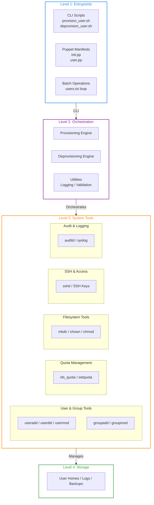
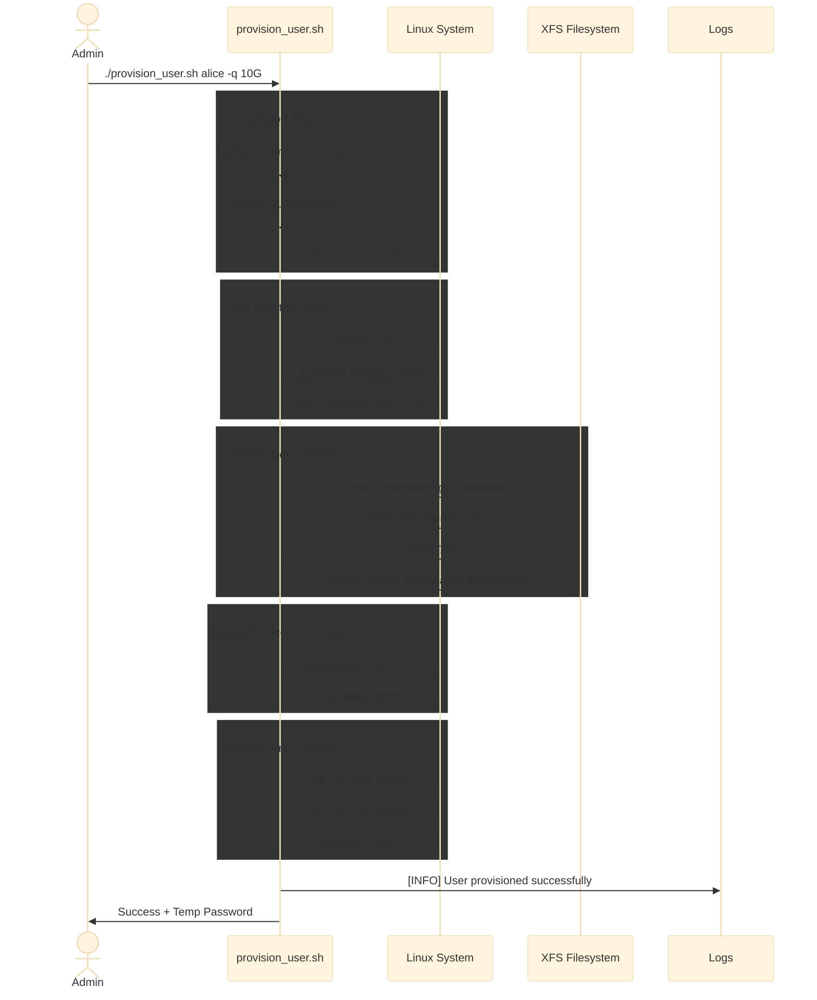
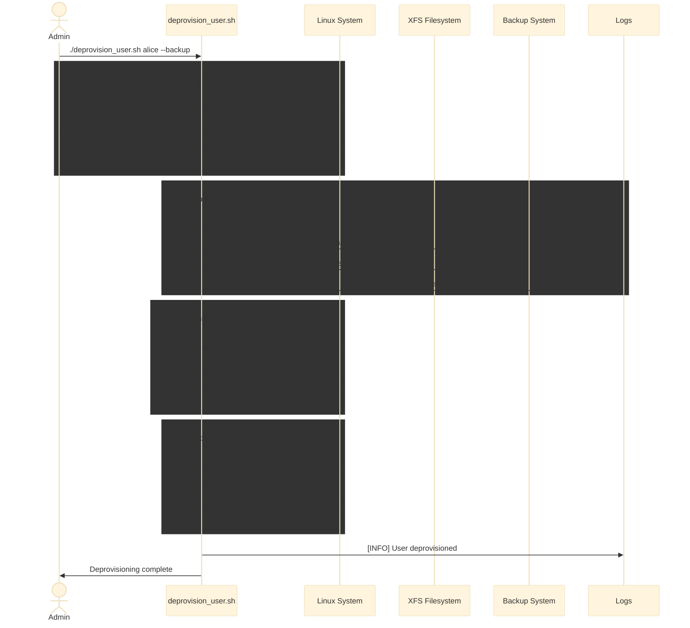
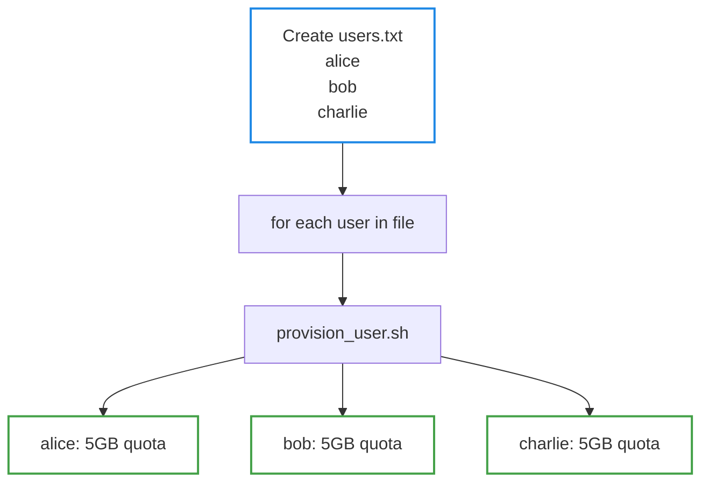
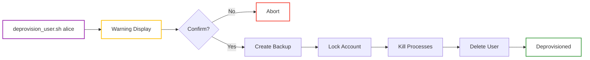

# Architecture: Automated Storage Provisioning Tool

## Overview

The Automated Storage Provisioning Tool is a containerized, enterprise-grade system for managing user accounts, storage directories, disk quotas, and access controls on Rocky Linux. This document describes the system design, components, data flow, and deployment model.

**Target Environment:** Rocky Linux 8/9 virtual machines with XFS filesystems  
**Automation Framework:** Puppet + Bash scripts  
**Use Case:** Multi-user environments requiring consistent, auditable storage management

## System Architecture Diagram


## Component Hierarchy



## Data Flow: Provisioning User



## Data Flow: Deprovisioning User



---

## Key Design Decisions

### 1. XFS + Quotas (Why XFS?)

**Decision:** Use XFS filesystem with user/group quotas.

**Rationale:**
- Rocky Linux default filesystem (modern, performant)
- Native project quota support (unlike ext4)
- Better for large files and concurrent I/O
- Tight integration with Linux enterprise tools

**Implementation:**
```bash
# /etc/fstab
/dev/mapper/rl-root / xfs defaults,usrquota,grpquota 0 0

# Verification
xfs_quota -x -c 'report -h' /
```

### 2. Bash + Puppet (Hybrid Approach)

**Decision:** Combine Bash scripts + Puppet manifests.

**Rationale:**

| Tool | Use Case |
|------|----------|
| **Bash** | Direct user provisioning, quick operations, testing |
| **Puppet** | Infrastructure-as-Code, multi-server deployment, idempotency |

**Benefit:** Flexibility for ad-hoc operations + consistency for bulk deployments.

### 3. Default Deny (SSH Access)

**Decision:** Disable SSH by default; enable on request.

**Rationale:**
- Security-first approach
- Reduces attack surface
- Admins explicitly enable per user
- Audit trail of who has access

### 4. Backup on Deprovision

**Decision:** Archive user data before deletion.

**Rationale:**
- Safety net for accidental deletions
- Legal/compliance requirements (data retention)
- Metadata tracking (audit trail)
- 30-day retention policy (configurable)

### 5. Centralized Logging

**Decision:** All operations logged to `/var/log/storage-provisioning/provisioning.log`.

**Rationale:**
- Single audit trail
- Timestamps + severity levels
- Searchable and parseable
- Integration with syslog/ELK (future)

---

## Security Model

### Authentication

| Method | Use | Status |
|--------|-----|--------|
| **Password** | Initial login | Temporary, force change |
| **SSH Keys** | Remote access | Optional, admin-enabled |
| **Puppet** | System automation | Runs as root with validation |

### Authorization

| Role | Permissions |
|------|-------------|
| **Admin** | Provision, deprovision, modify quotas |
| **User** | Read own files, write to own directory |
| **System** | Enforce quotas, prevent privilege escalation |

### Isolation

| Layer | Isolation Method |
|-------|------------------|
| **Filesystem** | User home directories (700 permissions) |
| **Process** | User cannot access other user data |
| **Quota** | Hard limits prevent disk exhaustion |
| **SSH/SFTP** | Chroot to user directory (optional) |
| **SELinux** | Custom contexts for storage paths |

### Audit Trail

```
Event                          → Logged To
─────────────────────────────────────────────
User provisioned              → /var/log/storage-provisioning/provisioning.log
User deprovisioned            → /var/log/storage-provisioning/provisioning.log
Directory accessed            → /var/audit/audit.log (auditd)
Quota exceeded                → /var/log/quota.log
SSH access attempt            → /var/log/auth.log
```

---

## Operational Workflows

### Workflow 1: Single User Provisioning

```mermaid
graph LR
    A["Admin: provision_user.sh alice"] --> B["Validate Input"]
    B --> C["Create User"]
    C --> D["Create Directory"]
    D --> E["Apply Quota"]
    E --> F["Configure Access"]
    F --> G["Log & Report"]
    G --> H["alice provisioned"]
    
    style A stroke:#1e88e5,stroke-width:2px,fill:none
    style H stroke:#43a047,stroke-width:2px,fill:none
    style B stroke:#ffc107,stroke-width:2px,fill:none
    style C stroke:#ff9800,stroke-width:2px,fill:none
    style E stroke:#f44336,stroke-width:2px,fill:none
```



### Workflow 2: Batch Provisioning



### Workflow 3: Safe Deprovisioning



---

## Monitoring & Observability

### Key Metrics

```
Metric                        Source          Query
─────────────────────────────────────────────────────
Users provisioned             Log file        grep "created successfully"
Users deprovisioned           Log file        grep "deprovisioned"
Average quota utilization     xfs_quota       "report -h"
Backups retained              Filesystem      ls -lh /var/backups/
Error rate                    Log file        grep "\[ERROR\]"
Operation latency             Log file        Parse timestamps
```

### Health Checks

```bash
# Check provisioning system health
./scripts/health_check.sh

Output:
  Quotas enabled
  Storage directory writable
  Log directory writable
  Puppet installed
  No pending backup deletions
  2 users over soft quota limit
```

---

## Scalability Considerations

### Current Scope

- Single VM deployment
- Manual user provisioning
- Local logging only
- Max ~1000 users (practical limit)

### Future Enhancements

| Enhancement | Benefit |
|-------------|---------|
| **Multi-VM deployment** | Scale across cluster |
| **REST API** | Programmatic access |
| **Grafana dashboards** | Real-time monitoring |
| **Prometheus metrics** | Time-series analytics |
| **LDAP integration** | Centralized identity |
| **Containerization** | Portable deployment |
| **Ansible wrapper** | Multi-OS support |

---

## Deployment Models

### Model 1: Standalone VM (Current)

```
Host → Rocky Linux VM (2 CPU, 4GB RAM, 40GB disk)
       ├── Puppet Agent
       ├── Storage provisioning scripts
       └── XFS quota system
```

**Pros:** Simple, easy to test, self-contained  
**Cons:** Single point of failure, limited scalability

### Model 2: Cluster Deployment (Future)

```
Host → Puppet Master
       ├─ Rocky Linux VM 1
       ├─ Rocky Linux VM 2
       └─ Rocky Linux VM 3
       
Storage Backend:
       ├─ NFS Server (for shared storage)
       └─ Backup Server (for archives)
```

**Pros:** High availability, distributed storage  
**Cons:** Complex management, network requirements

### Model 3: Containerized (Future)

```
Host → Podman/Docker Container
       ├── Rocky Linux base image
       ├── Puppet + scripts
       ├── Quota support
       └── Persistent volumes
```

**Pros:** Portable, ephemeral, easy to test  
**Cons:** Requires container orchestration

---

## Error Handling & Recovery

### Error Scenarios

| Error | Cause | Recovery |
|-------|-------|----------|
| "User already exists" | Duplicate provisioning | Deprovision + retry |
| "Quotas not enabled" | Filesystem not configured | Edit /etc/fstab + reboot |
| "Permission denied" | Not running with sudo | Re-run with `sudo` |
| "Backup failed" | Disk full | Free space + retry |
| "User locked in use" | Processes still running | `pkill -u username` + retry |

### Rollback Strategy

```
If provisioning fails:
  1. Check logs: tail /var/log/storage-provisioning/provisioning.log
  2. Restore VM snapshot: VirtualBox → Snapshots → Restore
  3. Or manual cleanup:
     - userdel -r username
     - xfs_quota remove limits
     - Investigate root cause
     - Retry with fixes
```

---

## Terminology & Concepts

### Core Technologies

#### XFS (X File System)
High-performance Linux filesystem used by Rocky Linux.  
- Supports project-based and user-based quotas natively.  
- Optimized for large files and concurrent I/O workloads.  
- Default filesystem for Rocky Linux and RHEL.  
- Tools: `xfs_quota`, `setquota`.

#### Puppet
Infrastructure-as-Code (IaC) automation framework for system configuration management.  
- Declarative and idempotent: applying the same manifest multiple times yields the same result.  
- Manifests describe desired system states (`init.pp`, `user.pp`).  
- Ensures consistent provisioning across multiple systems.

#### Bash
Standard Linux shell used for scripting direct provisioning and administrative tasks.  
- Executes core Linux utilities (`useradd`, `chmod`, `xfs_quota`).  
- Ideal for lightweight, ad-hoc, and test operations.  
- Integrates with Puppet for hybrid automation.

#### SSH (Secure Shell)
Encrypted protocol for secure remote access and file transfer (SFTP).  
- SSH Keys provide stronger authentication than passwords.  
- Chroot can restrict users to their home directories.  
- Configurable for per-user or per-group access.

#### Rocky Linux / RHEL
Enterprise-grade Linux distribution compatible with Red Hat Enterprise Linux (RHEL).  
- Stable, long-term support for enterprise environments.  
- Standardized tooling and predictable updates.  
- Default target OS for this project.

#### Sudo
Command-line utility that grants temporary root privileges.  
- Requires password confirmation for traceability.  
- All privileged provisioning operations use `sudo`.  
- Creates audit trail for administrative actions.

### Storage and Quota Concepts

| Concept | Description |
|----------|-------------|
| **Quota** | Disk space or inode limit assigned per user or group. Soft limits warn; hard limits enforce absolute ceilings. Prevents single users from exhausting shared storage. |
| **Inode** | Metadata structure storing file information (name, permissions, ownership, timestamps). Each file consumes one inode. Systems can run out of inodes even with free disk space. |
| **Filesystem** | Logical structure organizing files and directories. XFS supports quotas natively and scales efficiently for large datasets. Mount points attach filesystems to the Linux hierarchy. |
| **SELinux (Security-Enhanced Linux)** | Mandatory access control system extending beyond Unix permissions. Assigns security contexts to files and processes, enforcing policy-based restrictions. |

### User and Group Management

#### User Account
Unique system identity representing an individual or service.  
- Identified by a UID (user ID).  
- Associated with a shell, group memberships, and home directory.  
- Created with `useradd`; removed with `userdel -r`.  
- Default home: `/home/storage_users/{username}/`.

#### Group
Collection of users sharing common permissions.  
- Identified by a GID (group ID).  
- Example: `storage_users` group for all provisioned accounts.  
- Simplifies access control by managing permissions at group level.

#### Home Directory
Primary directory for user files and configuration.  
- Located under `/home/storage_users/{username}/`.  
- Owned by the user with mode `700` (owner-only access).  
- Contains subdirectories: `data/`, `backups/`, `temp/`, `logs/`.

#### PAM (Pluggable Authentication Modules)
Linux subsystem for authentication and session management.  
- Controls password verification, lockouts, and session policies.  
- Can enforce password expiration or login restrictions.

### Access Control and Security

| Term | Purpose |
|------|----------|
| **Authentication** | Verifies user identity. Uses passwords (temporary), SSH keys (cryptographic), or Puppet certificates. |
| **Authorization** | Determines permitted actions after authentication. Admins can provision and deprovision; users can only manage their own files. |
| **Chroot** | Restricts a user’s visible filesystem to a specific directory, e.g., `/home/storage_users/{username}/`. Common for SFTP-only access. |
| **SSH Key** | Public/private key pair for secure authentication. The public key is stored in `.ssh/authorized_keys`; the private key remains on the client. |

### Automation and Operations

#### Idempotent
Property where running an operation multiple times produces the same outcome as running it once.  
- Puppet manifests are idempotent by design.  
- Ensures safe, repeatable automation.

#### Provisioning
Creating and configuring new resources such as user accounts, directories, quotas, and permissions in one operation.  
- Implemented via `provision_user.sh` and Puppet manifests.  
- Validates inputs, creates user, applies quotas, and configures access.

#### Deprovisioning
Clean removal of user resources with audit and backup.  
- Archives user data before deletion.  
- Locks account, removes quotas, deletes directory.  
- Retains backup and metadata for compliance tracking.

#### Audit Trail
Comprehensive record of provisioning, deprovisioning, and system events.  
- Stored in `/var/log/storage-provisioning/provisioning.log`.  
- Includes timestamps, severity levels, and operation status.  
- Integrates with syslog or ELK for centralized analysis.

#### Cron Job
Scheduled task for recurring automation.  
- Examples: daily quota reports, cleanup scripts, or backup retention enforcement.  
- Configured via system `crontab` or under `/etc/cron.*`.

#### Manifest (Puppet)
Puppet configuration file (`.pp`) defining desired system state.  
- Written in Puppet’s Ruby-based DSL.  
- Applied via `puppet apply <manifest>` to enforce configuration.  

### Monitoring and Logging

| Term | Description |
|------|--------------|
| **Log File** | Text-based record of events with timestamps and severity levels (`INFO`, `ERROR`, `WARNING`). Primary log: `/var/log/storage-provisioning/provisioning.log`. |
| **Repquota** | Command-line utility for reporting disk quota usage. Displays usage, limits, and grace periods. |
| **Syslog / Journald** | Centralized Linux logging systems. Syslog is traditional; Journald is systemd-based. Can receive logs from provisioning scripts. |
| **Metrics** | Quantitative indicators for monitoring system health. Examples: users provisioned, quota utilization, error rate, and operation latency. |

### Backup and Recovery

#### Backup
Compressed copy (`.tar.gz`) of a user’s data for disaster recovery.  
- Created automatically during deprovisioning.  
- Includes metadata file with timestamp, username, and size.  
- Stored under `/var/backups/deprovisioned_users/`.

#### Snapshot
Point-in-time filesystem copy.  
- Faster restore but stored on the same system (not durable if disk fails).  
- Future support planned for snapshot-capable systems (e.g., Btrfs, Ceph).

#### Retention Policy
Defines how long backups are preserved before deletion.  
- Default: 30 days for deprovisioned user backups.  
- Balances compliance requirements and storage efficiency.