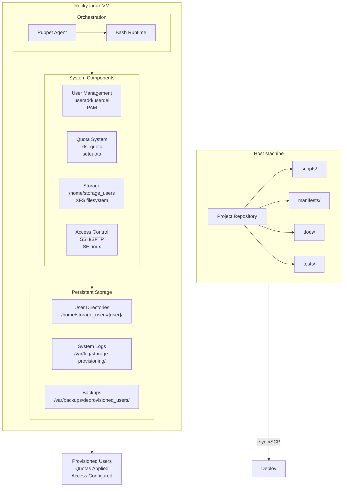
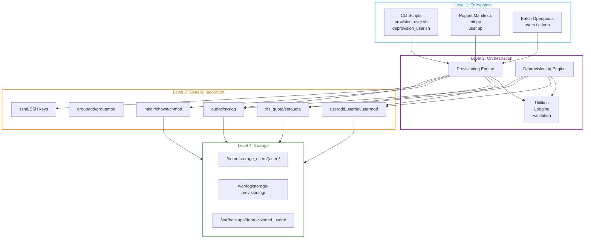
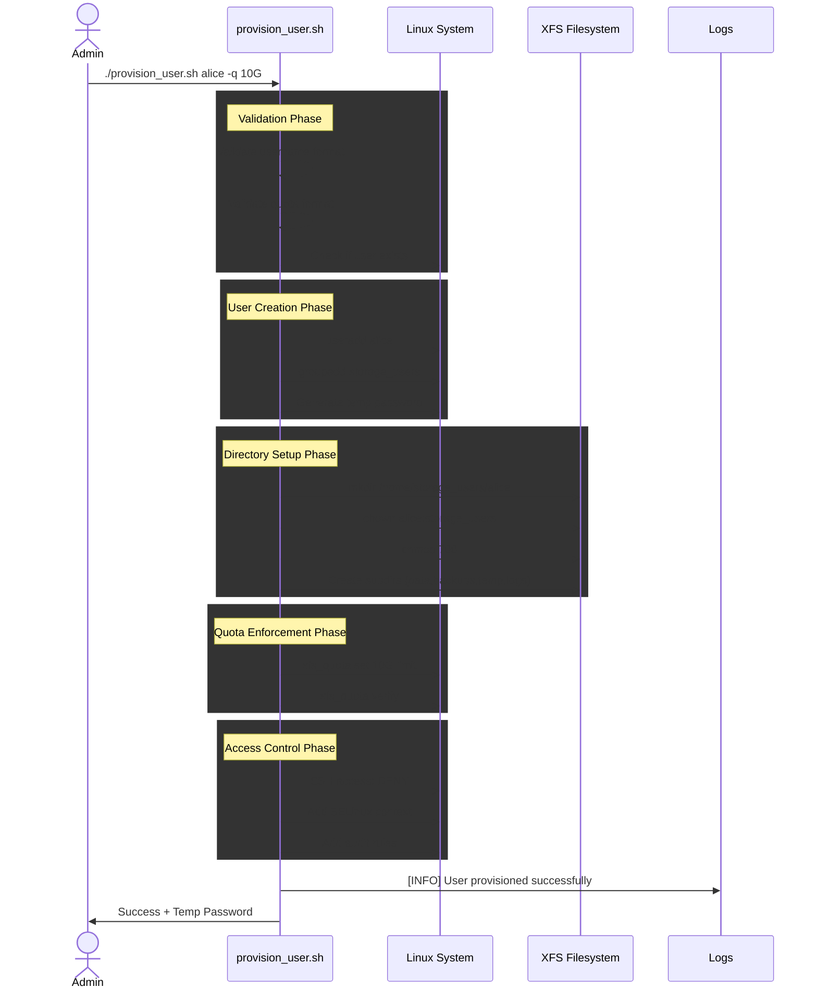
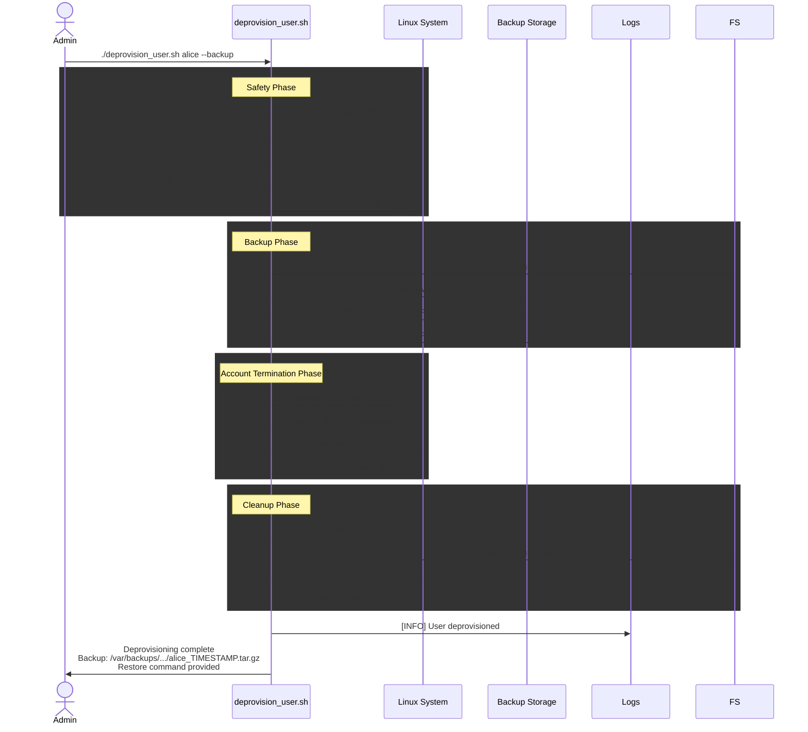
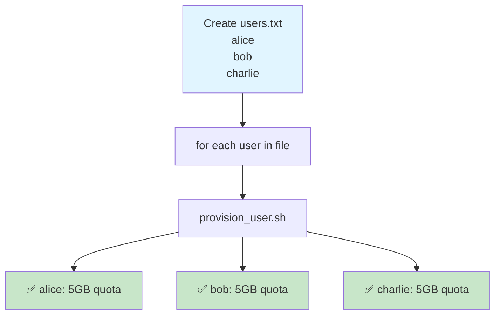
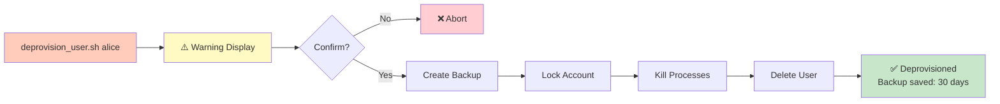

# Architecture: Automated Storage Provisioning Tool

## Overview

The Automated Storage Provisioning Tool is a containerized, enterprise-grade system for managing user accounts, storage directories, disk quotas, and access controls on Rocky Linux. This document describes the system design, components, data flow, and deployment model.

**Target Environment:** Rocky Linux 8/9 virtual machines with XFS filesystems  
**Automation Framework:** Puppet + Bash scripts  
**Use Case:** Multi-user environments requiring consistent, auditable storage management

## System Architecture Diagram



## Component Hierarchy



## Data Flow Diagrams

### User Provisioning Sequence Chart

### User Deprovisioning Sequence Chart

---

## Data Flow: Provisioning User



---

## Data Flow: Deprovisioning User



---

## Key Design Decisions

### 1. XFS + Quotas (Why XFS?)

**Decision:** Use XFS filesystem with user/group quotas.

**Rationale:**
- Rocky Linux default filesystem (modern, performant)
- Native project quota support (unlike ext4)
- Better for large files and concurrent I/O
- Tight integration with Linux enterprise tools

**Implementation:**
```bash
# /etc/fstab
/dev/mapper/rl-root / xfs defaults,usrquota,grpquota 0 0

# Verification
xfs_quota -x -c 'report -h' /
```

### 2. Bash + Puppet (Hybrid Approach)

**Decision:** Combine Bash scripts + Puppet manifests.

**Rationale:**

| Tool | Use Case |
|------|----------|
| **Bash** | Direct user provisioning, quick operations, testing |
| **Puppet** | Infrastructure-as-Code, multi-server deployment, idempotency |

**Benefit:** Flexibility for ad-hoc operations + consistency for bulk deployments.

### 3. Default Deny (SSH Access)

**Decision:** Disable SSH by default; enable on request.

**Rationale:**
- Security-first approach
- Reduces attack surface
- Admins explicitly enable per user
- Audit trail of who has access

### 4. Backup on Deprovision

**Decision:** Archive user data before deletion.

**Rationale:**
- Safety net for accidental deletions
- Legal/compliance requirements (data retention)
- Metadata tracking (audit trail)
- 30-day retention policy (configurable)

### 5. Centralized Logging

**Decision:** All operations logged to `/var/log/storage-provisioning/provisioning.log`.

**Rationale:**
- Single audit trail
- Timestamps + severity levels
- Searchable and parseable
- Integration with syslog/ELK (future)

---

## Security Model

### Authentication

| Method | Use | Status |
|--------|-----|--------|
| **Password** | Initial login | Temporary, force change |
| **SSH Keys** | Remote access | Optional, admin-enabled |
| **Puppet** | System automation | Runs as root with validation |

### Authorization

| Role | Permissions |
|------|-------------|
| **Admin** | Provision, deprovision, modify quotas |
| **User** | Read own files, write to own directory |
| **System** | Enforce quotas, prevent privilege escalation |

### Isolation

| Layer | Isolation Method |
|-------|------------------|
| **Filesystem** | User home directories (700 permissions) |
| **Process** | User cannot access other user data |
| **Quota** | Hard limits prevent disk exhaustion |
| **SSH/SFTP** | Chroot to user directory (optional) |
| **SELinux** | Custom contexts for storage paths |

### Audit Trail

```
Event                          → Logged To
─────────────────────────────────────────────
User provisioned              → /var/log/storage-provisioning/provisioning.log
User deprovisioned            → /var/log/storage-provisioning/provisioning.log
Directory accessed            → /var/audit/audit.log (auditd)
Quota exceeded                → /var/log/quota.log
SSH access attempt            → /var/log/auth.log
```

---

## Operational Workflows

### Workflow 1: Single User Provisioning


### Workflow 2: Batch Provisioning



### Workflow 3: Safe Deprovisioning



---

## Monitoring & Observability

### Key Metrics

```
Metric                        Source          Query
─────────────────────────────────────────────────────
Users provisioned             Log file        grep "created successfully"
Users deprovisioned           Log file        grep "deprovisioned"
Average quota utilization     xfs_quota       "report -h"
Backups retained              Filesystem      ls -lh /var/backups/
Error rate                    Log file        grep "\[ERROR\]"
Operation latency             Log file        Parse timestamps
```

### Health Checks

```bash
# Check provisioning system health
./scripts/health_check.sh

Output:
  ✅ Quotas enabled
  ✅ Storage directory writable
  ✅ Log directory writable
  ✅ Puppet installed
  ✅ No pending backup deletions
  ⚠️  2 users over soft quota limit
```

---

## Scalability Considerations

### Current Scope

- Single VM deployment
- Manual user provisioning
- Local logging only
- Max ~1000 users (practical limit)

### Future Enhancements

| Enhancement | Benefit |
|-------------|---------|
| **Multi-VM deployment** | Scale across cluster |
| **REST API** | Programmatic access |
| **Grafana dashboards** | Real-time monitoring |
| **Prometheus metrics** | Time-series analytics |
| **LDAP integration** | Centralized identity |
| **Containerization** | Portable deployment |
| **Ansible wrapper** | Multi-OS support |

---

## Deployment Models

### Model 1: Standalone VM (Current)

```
Host → Rocky Linux VM (2 CPU, 4GB RAM, 40GB disk)
       ├── Puppet Agent
       ├── Storage provisioning scripts
       └── XFS quota system
```

**Pros:** Simple, easy to test, self-contained  
**Cons:** Single point of failure, limited scalability

### Model 2: Cluster Deployment (Future)

```
Host → Puppet Master
       ├─ Rocky Linux VM 1
       ├─ Rocky Linux VM 2
       └─ Rocky Linux VM 3
       
Storage Backend:
       ├─ NFS Server (for shared storage)
       └─ Backup Server (for archives)
```

**Pros:** High availability, distributed storage  
**Cons:** Complex management, network requirements

### Model 3: Containerized (Future)

```
Host → Podman/Docker Container
       ├── Rocky Linux base image
       ├── Puppet + scripts
       ├── Quota support
       └── Persistent volumes
```

**Pros:** Portable, ephemeral, easy to test  
**Cons:** Requires container orchestration

---

## Error Handling & Recovery

### Error Scenarios

| Error | Cause | Recovery |
|-------|-------|----------|
| "User already exists" | Duplicate provisioning | Deprovision + retry |
| "Quotas not enabled" | Filesystem not configured | Edit /etc/fstab + reboot |
| "Permission denied" | Not running with sudo | Re-run with `sudo` |
| "Backup failed" | Disk full | Free space + retry |
| "User locked in use" | Processes still running | `pkill -u username` + retry |

### Rollback Strategy

```
If provisioning fails:
  1. Check logs: tail /var/log/storage-provisioning/provisioning.log
  2. Restore VM snapshot: VirtualBox → Snapshots → Restore
  3. Or manual cleanup:
     - userdel -r username
     - xfs_quota remove limits
     - Investigate root cause
     - Retry with fixes
```