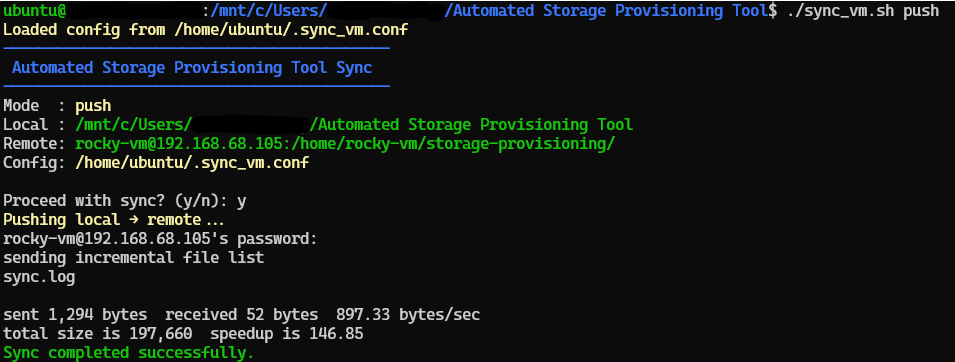

# File Synchronization Guide

## Overview

The `sync_vm.sh` script automates bidirectional file synchronization between your local machine and the remote VM using `rsync` over SSH. This enables seamless development workflows where you can edit files locally and sync them to the VM for testing, or pull changes back from the VM.

## Prerequisites

Before using the sync script, ensure:

- **Windows users:** Run all commands in WSL (Ubuntu/Linux terminal), not PowerShell. The script uses bash syntax which PowerShell does not understand.
- `rsync` is installed on both your local machine and the VM
- SSH key-based authentication is configured (see the main setup guide Step 3)
- The `sync_vm.sh` script is in your project directory
- SSH connection to the VM works: `ssh storage-vm`

### Install rsync

On your local machine:

```bash
# macOS
brew install rsync

# Ubuntu/Debian
sudo apt-get install rsync

# Windows (with WSL)
sudo apt-get install rsync

# Rocky Linux VM
sudo dnf install rsync
```

## Initial Setup

### Generate Configuration File

Run this once to create a personal config file:

```bash
./sync_vm.sh --setup-config
```

This creates `~/.sync_vm.conf` in your home directory with default paths. You should see:

```
Sample config created at /home/user/.sync_vm.conf
Edit it with your paths, then run: ./sync_vm.sh push
```

### Edit Configuration File

Open your config file and update the paths to match your setup:

```bash
nano ~/.sync_vm.conf
```

The file contains:

```bash
# Default local project directory
LOCAL_DIR="/path/to/your/project"

# Default remote VM target (user@host:/path)
REMOTE_TARGET="rocky-vm@192.168.68.105:/home/rocky-vm/storage-provisioning/"
```

Replace these values with your actual paths. The local directory should be where your project files are located. The remote target is where files will be synced on the VM.

## Basic Usage

### Push: Sync Local Files to VM

Upload your local project files to the VM:

```bash
./sync_vm.sh push
```

The script displays a summary of what will be synced and asks for confirmation:

```
-------------------------------------------
 Automated Storage Provisioning Tool Sync
-------------------------------------------
Mode  : push
Local : /home/user/my-project
Remote: rocky-vm@192.168.68.105:/home/rocky-vm/storage-provisioning/
Config: /home/user/.sync_vm.conf

Proceed with sync? (y/n):
```

Type `y` to confirm or `n` to abort.



### Pull: Sync VM Files to Local

Download files from the VM back to your local machine:

```bash
./sync_vm.sh pull
```

This is useful if you've made changes on the VM and want to bring them back to your local machine.

### Override Default Paths

Use custom paths without editing the config file:

```bash
./sync_vm.sh push /path/to/local rocky-vm@192.168.68.105:/remote/path
./sync_vm.sh pull /path/to/local rocky-vm@192.168.68.105:/remote/path
```

Example:

```bash
./sync_vm.sh push ./backend rocky-vm@192.168.68.105:/tmp/test-backend/
```

## Understanding rsync Syntax

### Trailing Slashes

Trailing slashes in rsync paths are significant and change behavior:

**With trailing slash (`/`):**

```bash
rsync -avz /local/dir/ remote:/target/
```

Syncs the **contents** of `/local/dir` into `/target`. If `/local/dir` contains `file.txt`, it appears as `/target/file.txt`, not `/target/dir/file.txt`.

**Without trailing slash:**

```bash
rsync -avz /local/dir remote:/target/
```

Syncs the **directory itself** into `/target`. Results in `/target/dir/file.txt`.

In `sync_vm.sh`, we always use a trailing slash on the local directory (`$LOCAL_DIR/`) to sync the contents, preventing nested folder duplication.

### Common rsync Flags

The script uses `rsync -avz --delete` with these flags:

| Flag | Meaning |
|------|---------|
| `-a` | Archive mode: preserves permissions, timestamps, and ownership |
| `-v` | Verbose: shows files being transferred |
| `-z` | Compress: compresses data during transfer (faster for large files) |
| `--delete` | Delete files on destination that don't exist on source |
| `--exclude` | Exclude specific files or patterns from sync |

### Example rsync Command

Without the script, syncing manually looks like:

```bash
rsync -avz --delete \
  --exclude ".git" \
  --exclude "logs" \
  --exclude "*.tmp" \
  /home/user/project/ \
  rocky-vm@192.168.68.105:/home/rocky-vm/storage-provisioning/
```

The `sync_vm.sh` script automates this, generating `--exclude` arguments from the `EXCLUDES` array.

## Excluded Files and Directories

By default, the following files and directories are **not** synced:

| Pattern | Purpose |
|---------|---------|
| `.git` | Version control metadata (usually very large) |
| `logs` | Log files that change frequently |
| `*.tmp` | Temporary files |
| `*.bak` | Backup files |
| `__pycache__` | Python cache directory |

To modify exclusions, edit the `EXCLUDES` array in `sync_vm.sh`:

```bash
EXCLUDES=(
  ".git"
  "logs"
  "*.tmp"
  "*.bak"
  "__pycache__"
  "node_modules"    # Add this to exclude npm packages
  ".env"            # Add this to exclude environment files
)
```

## Advanced Workflows

### Dry Run (Preview Changes)

To see what would be transferred without actually syncing:

```bash
rsync -avz --delete --dry-run \
  --exclude ".git" \
  ./project/ \
  rocky-vm@192.168.68.105:/home/rocky-vm/storage-provisioning/
```

This shows all files that would be transferred. No changes are made.

### One-Way Sync Only

To prevent the `--delete` flag from removing files:

```bash
rsync -avz \
  --exclude ".git" \
  ./project/ \
  rocky-vm@192.168.68.105:/home/rocky-vm/storage-provisioning/
```

Without `--delete`, files are only added/updated, never removed.

### Sync Specific Subdirectory

Sync only a portion of your project:

```bash
./sync_vm.sh push ./src/ rocky-vm@192.168.68.105:/home/rocky-vm/storage-provisioning/src/
```

### Monitor Sync Log

View all sync operations and timestamps:

```bash
tail -f ./sync.log
```

Shows real-time log entries as syncs occur.

## Troubleshooting

### "rsync not found"

The script requires `rsync` on both machines.

**Solution:** Install rsync (see Prerequisites section above).

### "Permission denied" Error

SSH authentication or file permissions are incorrect.

**Troubleshooting steps:**

1. Verify SSH key-based auth works:
   ```bash
   ssh storage-vm
   ```

2. Check you can manually access the remote directory:
   ```bash
   ssh rocky-vm@192.168.68.105 ls /home/rocky-vm/storage-provisioning/
   ```

3. Ensure the remote directory exists and is writable:
   ```bash
   ssh rocky-vm@192.168.68.105 mkdir -p /home/rocky-vm/storage-provisioning/
   ```

### "Invalid remote target format"

The `REMOTE_TARGET` doesn't match the required format.

**Expected format:** `user@host:/path`

**Example:** `rocky-vm@192.168.68.105:/home/rocky-vm/storage-provisioning/`

**Common mistakes:**

- Missing colon: `rocky-vm@192.168.68.105/path`
- Missing user: `192.168.68.105:/path`
- Missing path: `rocky-vm@192.168.68.105:`

### Nothing Is Syncing

If you run the script but no files transfer:

1. Check if files have actually changed since last sync
2. Verify the local directory path is correct:
   ```bash
   ls -la /path/to/local/dir
   ```

3. Run with verbose flag to see detail:
   ```bash
   rsync -avz --delete ... | head -20
   ```

4. Check the sync log:
   ```bash
   cat ./sync.log
   ```

### Sync Hangs or Takes Too Long

For large projects or slow connections:

1. **Exclude large directories:**
   ```bash
   # Add to EXCLUDES in sync_vm.sh
   "node_modules"
   "venv"
   ".venv"
   ```

2. **Use compression** (already enabled with `-z` flag)

3. **Test connection speed:**
   ```bash
   ping -c 4 192.168.68.105
   ```

4. **Monitor progress in another terminal:**
   ```bash
   tail -f ./sync.log
   ```

## Tips and Best Practices

- **Commit before pushing:** Use version control before syncing to the VM in case something goes wrong
- **Check the summary:** Always review the summary output before confirming with `y`
- **Use meaningful excludes:** Keep the excludes list clean to avoid unnecessary data transfer
- **Test with small changes first:** Before syncing large projects, try with a single file
- **Keep SSH alive:** For long syncs, consider using SSH keep-alive in `~/.ssh/config`:
  ```
  Host storage-vm
      ServerAliveInterval 60
      ServerAliveCountMax 3
  ```

## Additional Resources

- [rsync Manual](https://linux.die.net/man/1/rsync)
- [SSH Config Documentation](https://man.openbsd.org/ssh_config)
- SSH configuration and key setup details are in the main setup guide